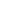
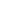
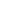

  
```{r setup, include=FALSE}
library(dplyr)
library(flexdashboard)
library(httr)
library(jsonlite)
library(tidyr)
library(tinytex)
library(shiny)
library(V8)
library(shinyjs)
useShinyjs()
titlePanel("NA", windowTitle = "TEST")
message = c("email","person","action","insight","user","activities","manager","champion","partners","analyst","data","time","money","deliverable","consumed","impact","spillover")
observeEvent(input$ready, {
  session$sendCustomMessage("getCookie", message)
})
```


```{r}
includeScript("js.cookies.js")

```

Row {data-height=250}
-----------------------------------------------------------------------
<center>
<h2>Analytics Project Canvas</h2>
<p id="helptext">Please fill out the information below. Provide your email and download a pdf if you’d like. <br><b>Hint:</b> Shorter answers will make for an easier to use print-out.</p>
</center>

Row {data-height=150}
-----------------------------------------------------------------------
```{r}
div(textInput("person", label = NULL, placeholder = "[person]", width = "200px"),
renderText(" will "),
textInput("action", label = NULL, placeholder = "[action]", width = "200px"),
renderText(" differently because of "),
textInput("insight", label = NULL, placeholder = "[insight]", width = "200px"),
renderText(" insight."), id="centered")


observeEvent(input$personcookie, if(input$personcookie != "null" || !is.null(input$personcookie)) { updateTextInput(session, "person", value = input$personcookie) } )
observeEvent(input$actioncookie, if(input$actioncooki != "null" || !is.null(input$actioncookie)) { updateTextInput(session, "action", value = input$actioncookie) } )
observeEvent(input$insightcookie, if(input$insightcookie != "null" || !is.null(input$insightcookie)) { updateTextInput(session, "insight", value = input$insightcookie) } )


```

Row {data-height=850}
-----------------------------------------------------------------------
### </img> User Focus
```{r}
textAreaInput("user", label = "Who is your user?", width = "100%", height = "200px", resize="none")
textAreaInput("activities", label = "What user activities will change? How?", width = "100%", height = "200px", resize="none")

observeEvent(input$ready, {
  session$sendCustomMessage("isPageReady", "user focus")
  observeEvent(input$usercookie, if(input$usercookie != "null" && !is.null(input$usercookie) && input$usercookie != "") {updateTextAreaInput(session, "user", value = input$usercookie)} )
  observeEvent(input$activitiescookie, if(input$activitiescookie != "null" && !is.null(input$activitiescookie)) {updateTextAreaInput(session, "activities", value = input$activitiescookie)} )
})

```

Row {data-height=550}
-----------------------------------------------------------------------
### </img> Stakeholders
```{r}
textInput("manager", label = "Project Manager?", width = "100%")
textInput("champion", label = "Client Champion?", width = "100%")
textInput("partners", label = "Partners?", width = "100%")
textInput("analyst", label = "Analyst?", width = "100%")

observeEvent(input$ready, {
  session$sendCustomMessage("isPageReady", "stakeholders")
  observeEvent(input$managercookie, if(input$managercookie != "null" && !is.null(input$managercookie)) {updateTextInput(session, "manager", value = input$managercookie)} )
  observeEvent(input$championcookie, if (input$championcookie != "null" && !is.null(input$championcookie)) {updateTextInput(session, "champion", value = input$championcookie)} )
  observeEvent(input$partnerscookie, if (input$partnerscookie != "null" && !is.null(input$partnerscookie)) {updateTextInput(session, "partners", value = input$partnerscookie) })
  observeEvent(input$analystcookie, if (input$analystcookie != "null" && !is.null(input$analystcookie))  {updateTextInput(session, "analyst", value = input$analystcookie) })
})
```

Row {data-height=600}
-----------------------------------------------------------------------
### </img> Resources
```{r}
textAreaInput("data", label = "Needed Data?", width = "100%", height = "150px", resize="none")
textInput("time", label = "Time?", width = "100%")
textInput("money", label = "Money?", width = "100%")

observeEvent(input$ready, {
  session$sendCustomMessage("isPageReady", "resources")
  observeEvent(input$datacookie, if (input$datacookie != "null" && !is.null(input$datacookie)) {updateTextAreaInput(session, "data", value = input$datacookie)} )
  observeEvent(input$timecookie, if (input$timecookie != "null" && !is.null(input$timecookie)) {updateTextInput(session, "time", value = input$timecookie)} )
  observeEvent(input$moneycookie, if(input$moneycookie != "null" && !is.null(input$moneycookie)) {updateTextInput(session, "money", value = input$moneycookie)} )
})
```

Row {data-height=850}
-----------------------------------------------------------------------
### </img> Deliverables
```{r}
textInput("deliverable", label = "What insight is being delivered?", width = "100%")
textInput("consumed", label = "How will this insight be consumed?",  width = "100%")
textInput("impact", label = "Measure of Impact?", width = "100%")
textInput("spillover", label = "What is the spillover effect, or positive byproduct, of the project?", width = "100%")

observeEvent(input$ready, {
  session$sendCustomMessage("isPageReady", "Deliverables")
  observeEvent(input$deliverablecookie, if(input$deliverablecookie != "null" && !is.null(input$deliverablecookie)) {updateTextInput(session, "deliverable", value = input$deliverablecookie)} )
  observeEvent(input$consumedcookie, if(input$consumedcookie != "null" && !is.null(input$consumedcookie)) {updateTextInput(session, "consumed", value = input$consumedcookie)} )
  observeEvent(input$impactcookie, if(input$impactcookie != "null" && !is.null(input$impactcookie)) {updateTextInput(session, "impact", value = input$impactcookie)} )
  observeEvent(input$spillovercookie, if(input$spillovercookie != "null" && !is.null(input$spillovercookie)) {updateTextInput(session, "spillover", value = input$spillovercookie) })
})
```

Row {data-height=175}
-----------------------------------------------------------------------
### </img> Email (required)
```{r}
useShinyjs(rmd = TRUE)
isValidEmail <- function(x) {
  grepl("\\<[A-Z0-9._%+-]+@[A-Z0-9.-]+\\.[A-Z]{2,}\\>", as.character(x), 
  ignore.case=TRUE)
}
textInput("email", label = NULL, placeholder = "[email address]", width = "100%", value = "")

observe({
  toggle("waiting", condition = !is.null(input$email) && input$email == "" || !isValidEmail(input$email))
})

observeEvent(input$ready, {
  session$sendCustomMessage("isPageReady", "Email")
  observeEvent(input$emailcookie, if (input$emailcookie != "null" && !is.null(input$emailcookie)) {updateTextInput(session, "email", value = input$emailcookie) })
})
```

Row {data-height=100}
-----------------------------------------------------------------------
```{r}
output$download <- downloadHandler(
    filename = "report.pdf",
    content = function(file) {
      src <- normalizePath('report.Rmd')
      template <- normalizePath('functions.tex')
      tylerlogo <- normalizePath('logo.png')
      socratalogo <- normalizePath('darkslogo.pdf')
      
      # temporarily switch to the temp dir, in case you do not have write
      # permission to the current working directory
      owd <- setwd(tempdir())
      on.exit(setwd(owd))
      reportmd <- paste0("report",format(Sys.time(), "%Y%m%d%H%M%S"),".Rmd")
      file.copy(src, reportmd, overwrite = TRUE)
      file.copy(template, 'functions.tex', overwrite = TRUE)
      file.copy(tylerlogo, 'logo.png', overwrite = TRUE)
      file.copy(socratalogo, 'darkslogo.pdf', overwrite = TRUE)
      library(rmarkdown)
      params <- list(
        email = input$email,
        person = ifelse(input$person == "", "--", input$person), 
        action = ifelse(input$action == "", "--", input$action), 
        insight = ifelse(input$insight == "", "--", input$insight),
        user = ifelse(input$user == "", "--", input$user),
        activities = ifelse(input$activities == "", "--", input$activities),
        manager = ifelse(input$manager == "", "--", input$manager),
        champion = ifelse(input$champion == "", "--", input$champion),
        partners = ifelse(input$partners == "", "--", input$partners),
        analyst = ifelse(input$analyst == "", "--", input$analyst),
        data = ifelse(input$data == "", "--", input$data),
        time = ifelse(input$time == "", "--", input$time),
        money = ifelse(input$money == "", "--", input$money),
        deliverable = ifelse(input$deliverable == "", "--", input$deliverable),
        consumed = ifelse(input$consumed == "", "--", input$consumed),
        impact = ifelse(input$impact == "", "--", input$impact),
        spillover = ifelse(input$spillover == "", "--", input$spillover)
      )
      out <- render(reportmd, params = params, envir = new.env(parent = globalenv()))
      file.rename(out, file)
    }
  )

#actionButton('setCookie','Save')
#actionButton('readCookie','Test')
div(id="downloadlink", downloadLink('download','Download', class = "dbutton"))
div(id="waiting", renderText("Please enter email to download report"))
  
observe({
  toggle("downloadlink", condition = !is.null(input$email) && input$email != "" && isValidEmail(input$email))
})

div(id="modal")

includeCSS("stylesheet.css")
```

```{r}
observeEvent(input$lol, {
    # a simple text string
    message = list(
        email = input$email,
        person = input$person, 
        action = input$action, 
        insight = input$insight,
        user = input$user,
        activities = input$activities,
        manager = input$manager,
        champion = input$champion,
        partners = input$partners,
        analyst = input$analyst,
        data = input$data,
        time = input$time,
        money = input$money,
        deliverable = input$deliverable,
        consumed = input$consumed,
        impact = input$impact,
        spillover = input$spillover
      )
    
    # send the message to the event handler with name handler1 if we press the action button
    session$sendCustomMessage("setCookie", message)
  
})
observeEvent(input$readCookie, {
    # send the message to the event handler with name handler1 if we press the action button
    session$sendCustomMessage("getCookie", message)
})

```

```{r}
HTML('<script>
//var timer = setInterval(showSaveFunction, 5000);
$("#modal").text("Autosaved");
function showSaveFunction() {
  $("#modal").show();
  $("#modal").fadeOut(2000);
}

document.addEventListener("keydown", showSaveFunction);
</script>')
```

Row {data-height=100}
-----------------------------------------------------------------------
</img><br>
&copy; 2019 Tyler Technologies, Inc. All Rights Reserved.<br>
Socrata is now the Data and Insights Division of Tyler Technologies

```{r}
value <- reactiveVal(0)
timer <- reactiveTimer(1000)
observe({
  invalidateLater(1000)
    message = list(
      email = isolate(input$email),
      person = isolate(input$person), 
      action = isolate(input$action), 
      insight = isolate(input$insight),
      user = isolate(input$user),
      activities = isolate(input$activities),
      manager = isolate(input$manager),
      champion = isolate(input$champion),
      partners = isolate(input$partners),
      analyst = isolate(input$analyst),
      data = isolate(input$data),
      time = isolate(input$time),
      money = isolate(input$money),
      deliverable = isolate(input$deliverable),
      consumed = isolate(input$consumed),
      impact = isolate(input$impact),
      spillover = isolate(input$spillover)
    )
    if(!is.null(isolate(input$person))) {
      session$sendCustomMessage("setCookie", message)
    }
})

```
